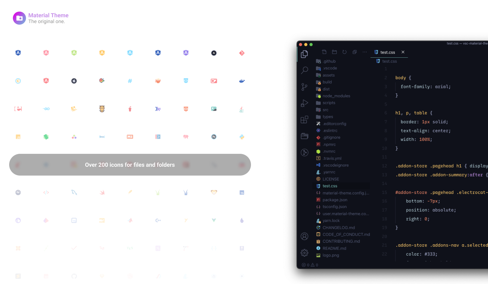

---
## Table of contents

The most epic file icon theme for Visual Studio Code. This is a reworked version of the famous Material Theme Icon pack.

- [Getting started](#getting-started)
  - [Installation](#installation)
  - [Activate theme](#activate-theme)
  - [Fix File Icons](#fix-file-icons)

# Getting started

You can install this awesome icon pack through the [Visual Studio Code Marketplace](https://marketplace.visualstudio.com/items?itemName=avalynndev.avalynnndev-icons).

## Fix File Icons

If you notice that the folder icons do not match the active Material Theme variant, you can fix it with just a command.

Launch *Quick Open*:

  -  <a href="https://code.visualstudio.com/shortcuts/keyboard-shortcuts-linux.pdf">Linux</a> `Ctrl + Shift + P`
  -  <a href="https://code.visualstudio.com/shortcuts/keyboard-shortcuts-macos.pdf">macOS</a> `⌘ + Shift + P`
  -  <a href="https://code.visualstudio.com/shortcuts/keyboard-shortcuts-windows.pdf">Windows</a> `Ctrl + Shift + P`

Type `avalynndev icons` and select `AvalynnDev Icons: Fix icons accent` from the drop-down menu. This command will set the correct icon theme.

---

Copyright &copy; 2025 avalynndev

Special thanks to Mattia Astorino & Alessio Occhipinti for creating this wonderful project.

